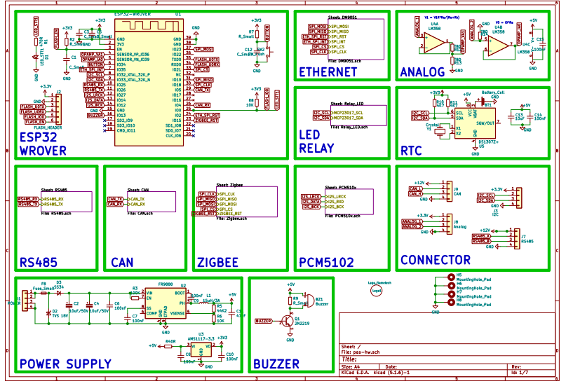
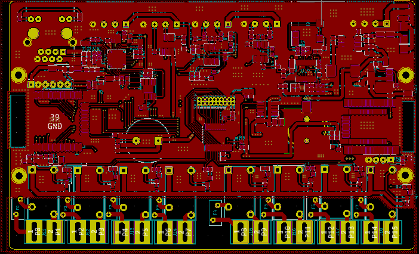
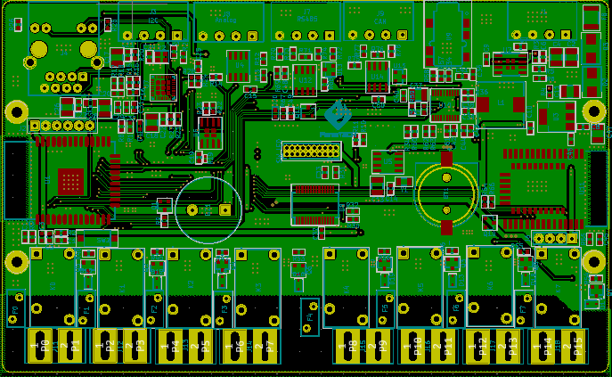
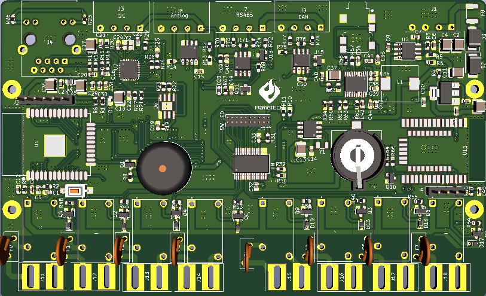
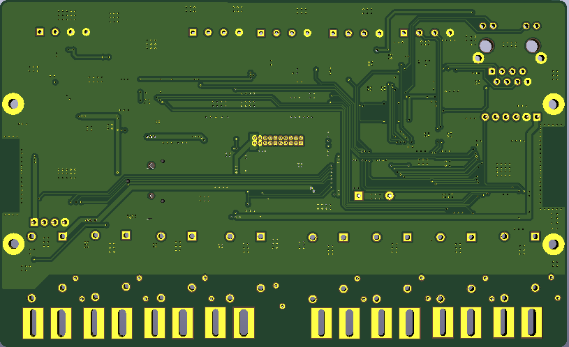

# ESP32_MODBUS_PCB_MASTER
# PROJECT sprinkler / irrigation controller    
## Hardware

### Schematics

### PCB Layout
#### Top side

#### Back side

### 3D

#### Top side

#### Back side

### Gerber

Version 3.0

- [Gerber V3
.0](./assets/gerber/PAS_v3.0.rar)
